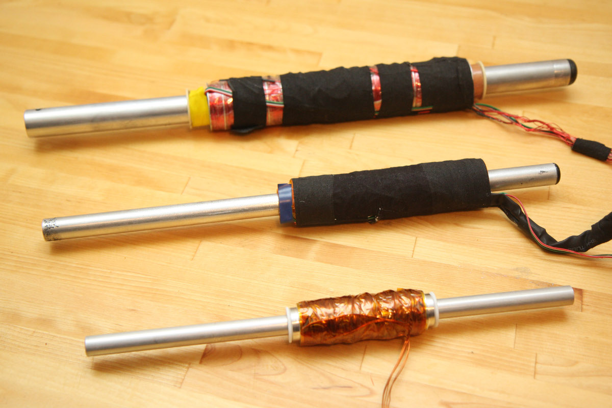
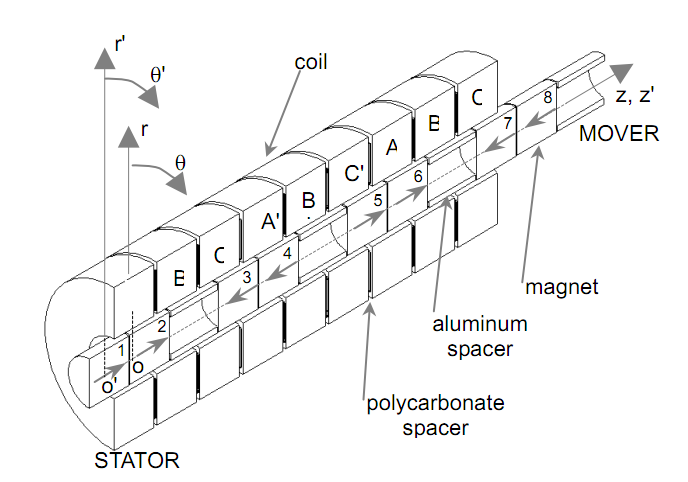
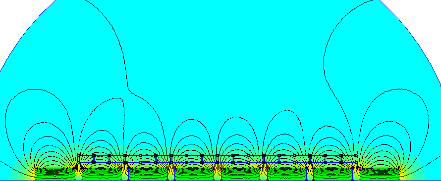
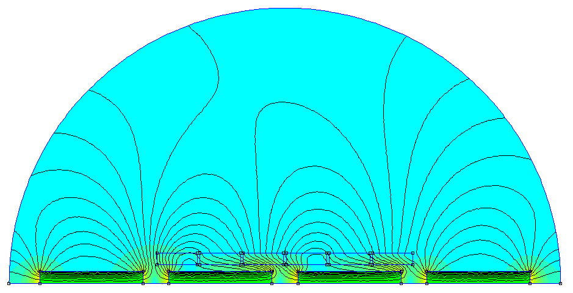

# open_linear_motor
Design files for a brushless linear motor project I worked on mostly from 2010-2012

Simulation uses the open source program FEMM, which runs in windows and linux (with wine)

https://www.femm.info/wiki/HomePage

